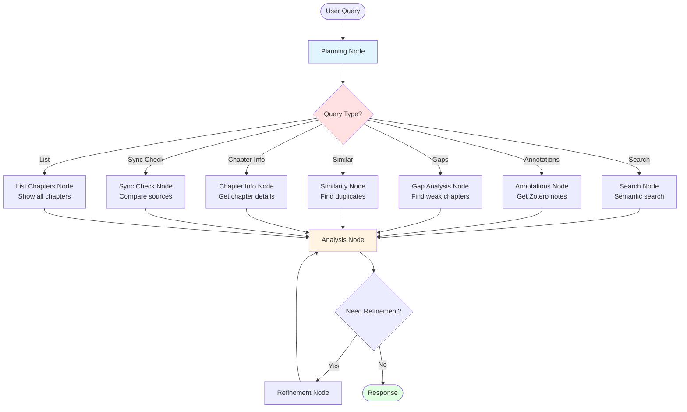

# Book Writing Buddy

Research assistant for book writers using Zotero and Scrivener. Indexes your research materials and provides intelligent search through Claude Code skills.

## What It Does

- **Indexes** your Zotero library and Scrivener manuscript with semantic embeddings
- **Searches** research materials using natural language queries
- **Analyzes** research gaps, duplicates, and coverage across chapters
- **Extracts** annotations, quotes, and key facts from your sources
- **Provides** chapter-level insights and cross-references

## Use Cases

- 📚 **Chapter Planning**: Produce a plan for writing a chapter based on chapter outline, research, and current manuscript draft, notes, and ideas.
- 🔍 **Semantic Search**: Find relevant passages across all materials
- 📊 **Gap Analysis**: Identify chapters that need more sources
- 📝 **Annotation Review**: Access all your Zotero highlights and notes
- 🔗 **Similarity Detection**: Check for duplicate content or plagiarism

## Quick Start

### Prerequisites

- Python 3.11+
- Docker & Docker Compose (for Qdrant)
- Zotero with local database
- Scrivener project
- Claude Code CLI
- uv package manager

### Installation

```bash
# Install dependencies
uv sync

# Configure paths
cp .env.example .env
# Edit .env with your Zotero and Scrivener paths

# Set up book context (optional but recommended)
cp data/outline.example.txt data/outline.txt
# Edit data/outline.txt with your book's themes and key concepts

# Start services (Qdrant + Indexer/Watcher)
docker compose up --build -d

# Check logs to see indexing progress
docker compose logs -f indexer

# You're ready! Use Claude Code
claude
```

### What You Can Do

The TUI agent understands natural language queries about your research:

**Search & Discovery:**
- "Search for climate adaptation research in chapter 5"
- "Find sources about urban heat islands"
- "What research do I have about flood prediction?"

**Annotations & Notes:**
- "Get all my Zotero annotations for chapter 9"
- "Show me highlights from chapter 3 sources"

**Analysis & Gaps:**
- "Which chapters need more research?"
- "Analyze research gaps across the manuscript"
- "What's missing from chapter 12?"

**Structure & Organization:**
- "List all my chapters"
- "Get information about chapter 15"
- "Check if my chapters are in sync"
- "What chapters does my book have?"

**Similarity & Plagiarism:**
- "Find similar content to this paragraph: [text]"
- "Check for duplicate content"

The agent automatically routes your query to the right tools and synthesizes results into actionable insights.

## Architecture

### System Overview

```
┌─────────────────────────────────────────┐
│  Your Computer                          │
│  ├─ Zotero/                            │
│  │  └─ Research PDFs, annotations      │
│  └─ Scrivener/                         │
│     └─ Draft manuscript                │
└─────────────────────────────────────────┘
          ↓ (read-only mount)
┌─────────────────────────────────────────┐
│  Docker: book-research-indexer         │
│  ├─ Watches files for changes          │
│  ├─ Extracts text & chunks it          │
│  ├─ Generates embeddings               │
│  └─ Stores in Qdrant                   │
└─────────────────────────────────────────┘
          ↓
┌─────────────────────────────────────────┐
│  Docker: Qdrant (port 6333)            │
│  └─ Vector database with embeddings    │
└─────────────────────────────────────────┘
          ↓ (query via BookRAG)
┌─────────────────────────────────────────┐
│  TUI Agent (LangGraph)                 │
│  └─ See agent flow diagram below       │
└─────────────────────────────────────────┘
```

### TUI Agent Flow

The agent uses LangGraph to route queries through specialized nodes:



**How it works:**
1. **Planning** - Classifies user query and determines which tool to use
2. **Tool Nodes** - Execute specific research operations (search, get annotations, etc.)
3. **Analysis** - LLM synthesizes results into coherent response
4. **Refinement** - Optional loop if user provides feedback

### How It Works

1. **Startup**: Docker container indexes all Zotero and Scrivener content
2. **Chunking**: Documents split into ~500-character semantic chunks
3. **Embedding**: Each chunk gets a 384-dimensional vector (all-MiniLM-L6-v2)
4. **Storage**: Vectors stored in Qdrant with metadata (chapter, source, etc.)
5. **Watching**: File watcher monitors for changes and re-indexes automatically (5 sec debounce)
6. **Querying**: Skills search the vector DB and return relevant results
7. **Analysis**: Claude synthesizes results into insights

## Configuration

### Zotero Setup

Your Zotero collections should follow this pattern:
```
FIREWALL/                          # Root collection
├── General Reference/             # Cross-chapter materials
├── __incoming/                    # Unsorted items
├── Part I. .../
│   ├── 1. chapter title
│   ├── 2. chapter title
│   └── ...
├── Part II. .../
│   └── ...
```

Collections are matched by number: `{chapter_number}.` prefix

### Scrivener Setup

The system automatically reads your chapter structure from the Scrivener `.scrivx` file. Organize your project with numbered chapters (e.g., "1. Chapter Title", "Chapter 1: Title") for best results.

The indexer will process RTF files in your Scrivener project and extract chapter numbers from folder names.

### Settings

Edit `config/default.json` for embedding and chunking parameters:

```json
{
  "embedding": {
    "model": "all-MiniLM-L6-v2",
    "chunk_size": 500,
    "chunk_overlap": 100,
    "vector_size": 384
  }
}
```

## Skills Reference

### search-research

Search indexed materials with semantic similarity.

**Parameters:**
- `query` (string, required): What to search for
- `chapter_number` (integer, optional): Filter to specific chapter
- `source_type` (string, optional): "zotero" or "scrivener"
- `limit` (integer, optional): Max results (default: 20)

**Example:**
```json
{
  "query": "infrastructure failures in coastal cities",
  "chapter_number": 9,
  "source_type": "zotero",
  "limit": 10
}
```

### get-annotations

Get all Zotero annotations for a chapter.

**Parameters:**
- `chapter_number` (integer, required): Chapter number (1-27)

**Returns:** All highlights, notes, and comments organized by source.

### analyze-gaps

Identify research gaps in your manuscript.

**Parameters:**
- `chapter_number` (integer, optional): Analyze specific chapter, or omit for manuscript-wide

**Returns:** Gap analysis with source counts, coverage metrics, recommendations.

### find-similar

Find similar or duplicate content.

**Parameters:**
- `text` (string, required): Text to find similarities for
- `threshold` (float, optional): Similarity threshold 0-1 (default: 0.85)
- `limit` (integer, optional): Max results (default: 10)

**Returns:** Similar content with scores and source info.

### get-chapter-info

Get comprehensive chapter information.

**Parameters:**
- `chapter_number` (integer, required): Chapter number

**Returns:** Zotero collection details, source count, Scrivener content stats.

## Indexing

### Automatic Indexing

The indexer container handles all indexing automatically:

- **Initial**: Indexes everything on first startup
- **Watching**: Monitors Zotero and Scrivener for changes
- **Re-indexing**: Automatically re-indexes changed files (5-second debounce)

### Manual Re-indexing

To force a complete re-index:

```bash
# Stop services
docker compose down

# Clear existing data
rm -rf data/qdrant_storage/*

# Restart (will re-index everything)
docker compose up --build -d

# Watch progress
docker compose logs -f indexer
```

### Check Indexing Status

```bash
# View indexer logs
docker compose logs indexer

# Check if indexing is complete (look for "Starting file watcher daemon")
docker compose logs indexer | tail -20

# Check collection size
curl http://localhost:6333/collections/book_research | jq
```

## Common Tasks

### View Logs
```bash
# Indexer logs
docker compose logs -f indexer

# Qdrant logs
docker compose logs -f qdrant

# Both
docker compose logs -f
```

### Stop/Start Services
```bash
# Stop everything
docker compose down

# Start everything
docker compose up -d

# Restart just the indexer
docker compose restart indexer
```

### Check What's Running
```bash
docker compose ps
```

## Keeping Structure in Sync

As you revise your book, chapter structure evolves. Keep these three sources aligned:

1. **Scrivener** (definitive source of truth) - Actual manuscript chapters
2. **Zotero Collections** - Research organized by chapter
3. **`data/outline.txt`** - Narrative context for the AI agent

### When You Restructure Chapters

**Scrivener is your source of truth.** When you reorganize in Scrivener:

1. Update Zotero collections to match (rename, renumber, merge as needed)
2. Update `data/outline.txt` with new structure
3. Re-index if chapter numbers changed: `docker compose restart indexer`

### Check Sync Status

Ask the AI agent to check alignment:

```
"Check if my chapters are in sync"
"Run the sync check"
```

This reports:
- Chapter counts across all sources
- Specific mismatches
- Recommendations for fixing

### Common Scenarios

**Adding a chapter:** Create matching Zotero collection `{number}. {title}`, update outline.txt, restart indexer

**Renumbering chapters:** Rename Zotero collections to match, update outline.txt, full re-index (clear data/qdrant_storage)

**Merging chapters:** Consolidate Zotero materials, update outline.txt, full re-index

**The AI agent handles sync gracefully** - it will note discrepancies, ask clarifying questions, and work with available data rather than failing.

## Troubleshooting

### "Zotero database locked"
**Cause:** Zotero application is running
**Fix:** Close Zotero before indexing

### "Qdrant connection refused"
**Cause:** Qdrant container not running
**Fix:** `docker compose up -d`

### "No results found"
**Cause:** Database not indexed yet
**Fix:** Check indexer logs: `docker compose logs indexer`

### "Indexer not starting"
**Cause:** Missing .env file or incorrect paths
**Fix:** Verify `.env` has correct paths to Zotero and Scrivener

### "Module not found"
**Cause:** Dependencies not installed
**Fix:** `uv sync`

### "Chapter not found"
**Cause:** Collection name doesn't match pattern
**Fix:** Verify Zotero collections start with `{number}.`

## Project Structure

```
book-writing-buddy/
├── README.md
├── CLAUDE.md                  # Project context for Claude Code
├── docker-compose.yml         # Qdrant container
├── pyproject.toml            # Python dependencies (uv)
├── config/
│   └── default.json          # Settings
├── .claude/
│   └── skills/               # Claude Code skills
│       ├── search-research/
│       ├── get-annotations/
│       ├── analyze-gaps/
│       ├── find-similar/
│       └── get-chapter-info/
├── scripts/
│   ├── index_all.py          # Index everything
│   ├── index_zotero.py       # Index Zotero only
│   └── index_scrivener.py    # Index Scrivener only
├── src/
│   ├── indexer/              # Indexing logic
│   │   ├── chunking.py
│   │   ├── zotero_indexer.py
│   │   └── scrivener_indexer.py
│   ├── vectordb/
│   │   └── client.py         # Qdrant wrapper
│   └── skills/               # Reusable skill logic
│       ├── fact_extractor.py
│       ├── annotation_aggregator.py
│       └── ...
└── data/
    └── qdrant_storage/       # Vector database (gitignored)
```

## Performance

- **Initial indexing**: 10-30 minutes for large libraries
- **Embedding model**: all-MiniLM-L6-v2 (fast, CPU-friendly)
- **Disk space**: ~10-20% of source material size
- **Search speed**: Sub-second for most queries

## Environment Variables

Create a `.env` file (see `.env.example`):

```bash
# Zotero data directory (contains zotero.sqlite and storage/)
ZOTERO_DATA_PATH=/Users/yourusername/Zotero

# Scrivener project file (.scriv)
SCRIVENER_PROJECT_PATH=/Users/yourusername/Dropbox/Apps/Scrivener/Project.scriv

# Debug mode (optional)
DEBUG=false
```

These are used by the Docker container for mounting directories.

## FAQ

**Q: Does this draft content for me?**
A: No. It organizes and searches your research. You write the book.

**Q: Do I need to keep Zotero running?**
A: Close Zotero when indexing (database lock). Otherwise it can run.

**Q: How often should I re-index?**
A: The file watcher automatically re-indexes when files change. No manual action needed!

**Q: Can I use this with other note-taking apps?**
A: Currently Zotero and Scrivener only, but the architecture is extensible.

**Q: Is my research sent to the cloud?**
A: Indexing is 100% local. Only Claude Code queries use the Claude API.

**Q: What if I don't have chapter numbers?**
A: The system will still work, you just can't filter by chapter.

## Tips

- **Close Zotero** before starting to avoid database locks
- **Wait for initial indexing** - Look for "Starting file watcher daemon" in logs
- **File watcher is automatic** - Add research anytime, it'll be indexed
- **Use natural language** with skills - no need for exact syntax
- **Skills work best** with chapter-organized Zotero collections (numbered)
- **Monitor performance** with `docker stats` if needed

## License

MIT License

## Acknowledgments

- [Qdrant](https://qdrant.tech/) - Vector database
- [sentence-transformers](https://www.sbert.net/) - Embeddings
- [Anthropic Claude](https://www.anthropic.com/claude) - Claude Code
- [uv](https://github.com/astral-sh/uv) - Python package manager

---

**Note**: This tool helps you search and analyze research, not replace your writing process.
