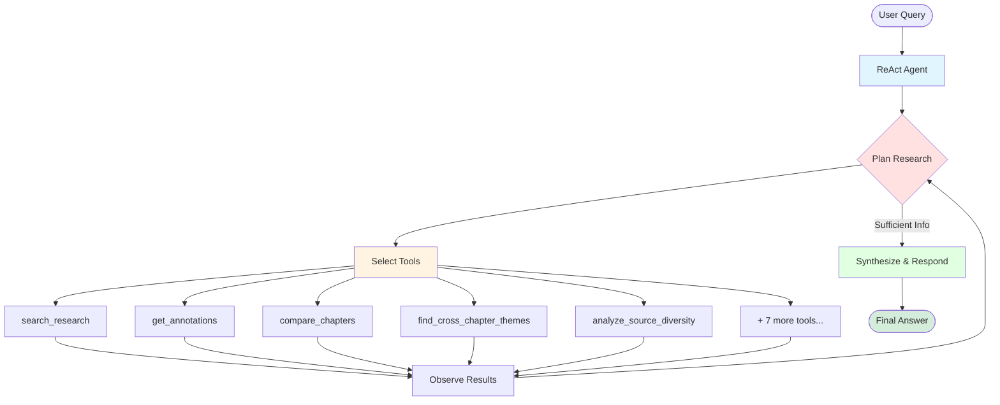

# Book Writing Buddy

Research assistant for book writers using Zotero and Scrivener. Indexes your research materials and provides intelligent search through Claude Code skills.

## What It Does

- **Indexes** your Zotero library and Scrivener manuscript with semantic embeddings
- **Searches** research materials using natural language queries
- **Analyzes** research gaps, duplicates, and coverage across chapters
- **Extracts** annotations, quotes, and key facts from your sources
- **Provides** chapter-level insights and cross-references

## Use Cases

- 📚 **Chapter Planning**: Produce a plan for writing a chapter based on chapter outline, research, and current manuscript draft, notes, and ideas.
- 🔍 **Semantic Search**: Find relevant passages across all materials
- 📊 **Gap Analysis**: Identify chapters that need more sources
- 📝 **Annotation Review**: Access all your Zotero highlights and notes
- 🔗 **Similarity Detection**: Check for duplicate content or plagiarism

## Quick Start

### Prerequisites

- Python 3.11+
- Docker & Docker Compose (for Qdrant)
- Zotero with local database
- Scrivener project
- Claude Code CLI
- uv package manager

### Installation

```bash
# Install dependencies
uv sync

# Configure paths
cp .env.example .env
# Edit .env with your Zotero and Scrivener paths

# Set up book context (optional but recommended)
cp data/outline.example.txt data/outline.txt
# Edit data/outline.txt with your book's themes and key concepts

# Start services (Qdrant + Indexer/Watcher)
docker compose up --build -d

# Check logs to see indexing progress
docker compose logs -f indexer

# You're ready! Start the TUI agent
uv run main.py
```

**Note:** You can also use the Claude Code CLI directly with `claude` if you have it installed.

### What You Can Do

The TUI agent understands natural language queries about your research:

**Search & Discovery:**
- "Search for climate adaptation research in chapter 5"
- "Find sources about urban heat islands"
- "What research do I have about flood prediction?"

**Annotations & Notes:**
- "Get all my Zotero annotations for chapter 9"
- "Show me highlights from chapter 3 sources"

**Analysis & Gaps:**
- "Which chapters need more research?"
- "Analyze research gaps across the manuscript"
- "What's missing from chapter 12?"

**Structure & Organization:**
- "List all my chapters"
- "Get information about chapter 15"
- "Check if my chapters are in sync"
- "What chapters does my book have?"

**Cross-Chapter Analysis:**
- "Track the theme 'resilience' across all chapters"
- "Compare research density between chapters 5 and 9"
- "What are the key sources for chapter 3?"
- "Analyze source diversity for chapter 12"

**Similarity & Plagiarism:**
- "Find similar content to this paragraph: [text]"
- "Check for duplicate content"

**Export & Bibliography:**
- "Export a research summary for chapter 7"
- "Generate an APA bibliography for chapter 4"

The agent **autonomously decides** which tools to use, can call multiple tools, and synthesizes results into comprehensive, cited responses.

## Architecture

### System Overview

```
┌─────────────────────────────────────────┐
│  Your Computer                          │
│  ├─ Zotero/                            │
│  │  └─ Research PDFs, annotations      │
│  └─ Scrivener/                         │
│     └─ Draft manuscript                │
└─────────────────────────────────────────┘
          ↓ (read-only mount)
┌─────────────────────────────────────────┐
│  Docker: book-research-indexer         │
│  ├─ Watches files for changes          │
│  ├─ Extracts text & chunks it          │
│  ├─ Generates embeddings               │
│  └─ Stores in Qdrant                   │
└─────────────────────────────────────────┘
          ↓
┌─────────────────────────────────────────┐
│  Docker: Qdrant (port 6333)            │
│  └─ Vector database with embeddings    │
└─────────────────────────────────────────┘
          ↓ (query via BookRAG)
┌─────────────────────────────────────────┐
│  TUI Agent (LangGraph ReAct)           │
│  └─ 12 research tools                  │
│  └─ Autonomous research loop           │
└─────────────────────────────────────────┘
```

### Agent Architecture

The TUI agent uses a **ReAct (Reasoning + Acting)** pattern with direct tool access. Instead of rigid workflows, the agent autonomously decides which tools to use and when.



**How it works:**

1. **User Query** → Agent receives natural language question
2. **ReAct Loop** (autonomous):
   - **Think**: "What information do I need?"
   - **Act**: Use tools to gather data (can use multiple tools)
   - **Observe**: Examine tool results
   - **Repeat**: Continue until sufficient information gathered
3. **Synthesize** → Agent analyzes all results
4. **Respond** → Present findings with citations and insights

### Available Tools (12 total)

The agent has direct access to these research tools:

**Core Research:**
- `search_research` - Semantic search with chapter filtering
- `get_annotations` - Retrieve Zotero highlights and notes
- `get_chapter_info` - Detailed chapter statistics
- `list_chapters` - Book structure from Scrivener
- `check_sync` - Alignment status between sources
- `get_scrivener_summary` - Per-chapter indexing breakdown

**Analysis:**
- `compare_chapters` - Compare research density between chapters
- `find_cross_chapter_themes` - Track themes across the manuscript
- `analyze_source_diversity` - Check source type balance
- `identify_key_sources` - Find most-cited sources

**Export:**
- `export_chapter_summary` - Generate research briefs
- `generate_bibliography` - Create citations (APA/MLA/Chicago)

The agent **autonomously chooses** which tools to use and can combine them creatively to answer complex questions.

### How It Works

1. **Startup**: Docker container indexes all Zotero and Scrivener content
2. **Chunking**: Documents split into ~500-character semantic chunks
3. **Embedding**: Each chunk gets a 384-dimensional vector (all-MiniLM-L6-v2)
4. **Storage**: Vectors stored in Qdrant with metadata (chapter, source, etc.)
5. **Watching**: File watcher monitors for changes and re-indexes automatically (5 sec debounce)
6. **Querying**: Skills search the vector DB and return relevant results
7. **Analysis**: Claude synthesizes results into insights

## Configuration

### Zotero Setup

Your Zotero collections should follow this pattern:
```
FIREWALL/                          # Root collection
├── General Reference/             # Cross-chapter materials
├── __incoming/                    # Unsorted items
├── Part I. .../
│   ├── 1. chapter title
│   ├── 2. chapter title
│   └── ...
├── Part II. .../
│   └── ...
```

Collections are matched by number: `{chapter_number}.` prefix

### Scrivener Setup

The system automatically reads your chapter structure from the Scrivener `.scrivx` file and assigns sequential chapter numbers.

**Chapter Numbering:**
- **Chapters 1-N**: Regular chapters are assigned sequential numbers (1, 2, 3...) based on their order in the manuscript
- **Chapter 0**: Preface or Introduction are automatically assigned chapter number 0
  - If you have **only one** of "Preface" or "Introduction", it gets chapter number **0**
  - If you have **both** Preface and Introduction, they get **0A** and **0B** respectively
- **Manuscript Folder**: Set `SCRIVENER_MANUSCRIPT_FOLDER` in `.env` to specify which folder contains your manuscript (e.g., "FIREWALL", "Manuscript", "Draft")
  - Only documents inside this folder will be indexed
  - Documents in Research, Trash, or other folders are excluded

**Recommended Structure:**
```
YourProject.scriv/
└── Manuscript (or your folder name)/
    ├── Preface                    # → Chapter 0
    ├── Part I/
    │   ├── Chapter 1 Title       # → Chapter 1
    │   └── Chapter 2 Title       # → Chapter 2
    ├── Part II/
    │   ├── Chapter 3 Title       # → Chapter 3
    │   └── ...
    └── ...
```

The indexer will process all RTF files in your manuscript folder and propagate chapter numbers to nested documents.

### Settings

Edit `config/default.json` for embedding and chunking parameters:

```json
{
  "embedding": {
    "model": "all-MiniLM-L6-v2",
    "chunk_size": 500,
    "chunk_overlap": 100,
    "vector_size": 384
  }
}
```

## Advanced Features

### Cross-Chapter Theme Tracking

Track how concepts and themes develop across your manuscript:

```
"Track the theme 'infrastructure failure' across all chapters"
"Where does 'resilience' appear in the book?"
```

The agent uses semantic search to find related content even when exact wording differs.

### Chapter Comparison

Compare research density and coverage:

```
"Compare research density between chapters 5 and 9"
"Which has more sources, chapter 3 or chapter 7?"
```

Helps identify chapters that need more research and maintain balanced coverage.

### Source Diversity Analysis

Evaluate whether you're relying too heavily on one type of source:

```
"Analyze source diversity for chapter 3"
"Am I using a good mix of sources in chapter 9?"
```

Uses Simpson's Diversity Index to measure balance across books, articles, reports, etc.

### Research Export

Generate formatted summaries and bibliographies:

```
"Export a research summary for chapter 7"
"Generate an APA bibliography for chapter 4"
"Create a research brief for chapter 5 in markdown"
```

Perfect for preparing reference materials before writing sessions.

## Offline Operation

The app supports **~90% offline operation** out of the box, with automatic fallback to fully offline mode.

### What's Already Offline

- ✅ **Embeddings**: Uses local `sentence-transformers` model (`all-MiniLM-L6-v2`)
- ✅ **Vector Database**: Qdrant runs locally in Docker
- ✅ **Data Sources**: Zotero + Scrivener are local files
- ✅ **Indexing**: All text extraction and chunking happens locally
- ⚠️ **LLM Agent**: By default uses online API, but **automatically falls back to Ollama** if unavailable

### Fully Offline Setup with Ollama

To run 100% offline, install Ollama for the conversational agent:

#### 1. Install Ollama

```bash
# macOS/Linux
curl -fsSL https://ollama.com/install.sh | sh

# Or download from https://ollama.com
```

#### 2. Pull a Model

```bash
# Recommended: Fast 3B model (good for most tasks)
ollama pull llama3.2:3b

# Alternative: Better quality 8B model (slower but higher quality)
ollama pull llama3.1:8b
```

#### 3. Configure `.env`

```bash
# Set your offline model preference
OFFLINE_AGENT_MODEL=llama3.2:3b

# Ollama URL (default works for most setups)
OLLAMA_BASE_URL=http://localhost:11434/v1
```

#### 4. Start Ollama

```bash
# Ollama runs as a service (usually auto-starts)
# If not running, start it:
ollama serve
```

### How Automatic Fallback Works

The agent intelligently handles connection failures:

1. **Startup**: Tries to connect to your configured online LLM (e.g., Claude, GPT)
2. **Fallback**: If connection fails, automatically switches to local Ollama
3. **Notification**: CLI shows which mode is active (online or offline)
4. **Streaming**: In offline mode, responses stream token-by-token so you can see progress

**No configuration needed** - it just works! If online LLM is unavailable (no internet, API down, etc.), the app seamlessly switches to offline mode.

### Model Cache

Embedding models are cached locally for faster loading:

- **Location**: `./data/models/`
- **Model**: `all-MiniLM-L6-v2` (~90 MB)
- **Docker Mount**: Mounted read-only into containers
- **Environment**: `MODEL_CACHE_DIR=./data/models`

To re-download the model:

```bash
uv run python scripts/download_model.py
docker compose up --build -d
```

### Model Recommendations

Choose a model based on your hardware and quality needs:

**Small/Fast (3B-7B)** - Good for basic queries, fast responses:
- `llama3.2:3b` - Very fast, good for most tasks
- `phi3:mini` - Fast with good reasoning
- `mistral:7b` - Balanced speed/quality

**Medium/Better (8B-14B)** - Better quality, moderate speed:
- `llama3.1:8b` - Good quality, reasonable speed
- `qwen2.5:14b-instruct` - Excellent quality, slower
- `mistral:8x7b` - High quality, needs more RAM

**Large/Best (70B+)** - Highest quality, slowest:
- `llama3.1:70b` - Excellent quality
- Requires powerful hardware (GPU recommended)

### Performance Comparison

| Aspect | Online Mode | Offline Mode |
|--------|-------------|--------------|
| **Speed** | Very fast (milliseconds) | Slower (seconds) |
| **Quality** | Highest (Claude, GPT) | Good (depends on model) |
| **Privacy** | Data sent to API | 100% local |
| **Network** | Required | Not required |
| **Cost** | API costs | Free (electricity) |
| **RAM** | Minimal | 4-16GB depending on model |

### Testing Offline Mode

Verify your offline setup works:

```bash
# Run automated tests
uv run python scripts/test_offline_fallback.py

# Test forced offline (simulates network failure)
uv run python scripts/test_forced_offline.py

# Test manually
# Disconnect from internet, then:
uv run main.py
```

### Troubleshooting Offline Mode

**Ollama not connecting:**
```bash
# Check if Ollama is running
ollama list

# Check Ollama service
ps aux | grep ollama
curl http://localhost:11434/api/tags

# Restart Ollama
# macOS: brew services restart ollama
# Linux: sudo systemctl restart ollama
# Manual: ollama serve
```

**Model not found:**
```bash
# Pull the model
ollama pull llama3.2:3b

# List installed models
ollama list

# Check .env matches installed model
grep OFFLINE_AGENT_MODEL .env
```

**Slow responses:**
- Use smaller model: `ollama pull llama3.2:3b`
- Ollama automatically uses GPU if available
- Check GPU usage: `nvidia-smi` (NVIDIA) or Activity Monitor (macOS)
- Close other resource-intensive applications

**Connection timeout:**
If your system is slow, increase timeout in `src/agent_v2.py` line ~133:
```python
if test_llm_connection(offline_llm, timeout=30):  # Increase from 10
```

### Advanced Usage

**Force offline mode** (always use Ollama):
```bash
# In .env
OPENAI_API_KEY="offline"
OPENAI_API_BASE="http://invalid:9999"
```

**Multiple Ollama instances** (different models on different ports):
```bash
# Terminal 1
OLLAMA_HOST=127.0.0.1:11434 ollama serve

# Terminal 2
OLLAMA_HOST=127.0.0.1:11435 ollama serve

# In .env
OLLAMA_BASE_URL=http://localhost:11435/v1
```

**Check mode programmatically:**
```python
from src.agent_v2 import is_using_offline_mode

if is_using_offline_mode():
    print("Running in offline mode")
```

### Privacy & Security

**Online Mode:**
- Queries sent to API provider (Cornell LiteLLM, OpenAI, etc.)
- Subject to provider's privacy policy
- May be logged/stored by provider

**Offline Mode:**
- Everything runs locally on your machine
- No data sent to external services
- 100% private operation

**Best Practices:**
1. Keep both modes ready - install Ollama even if using online primarily
2. Test offline regularly to verify fallback works
3. Right-size your model for your hardware
4. Monitor performance and adjust model size accordingly
5. Update models regularly: `ollama pull <model>`

## Indexing

### Automatic Indexing

The indexer container handles all indexing automatically:

- **Initial**: Indexes everything on first startup
- **Watching**: Monitors Zotero and Scrivener for changes
- **Re-indexing**: Automatically re-indexes changed files (5-second debounce)

### Manual Re-indexing

To force a complete re-index:

```bash
# Stop services
docker compose down

# Clear existing data
rm -rf data/qdrant_storage/*

# Restart (will re-index everything)
docker compose up --build -d

# Watch progress
docker compose logs -f indexer
```

### Check Indexing Status

```bash
# View indexer logs
docker compose logs indexer

# Check if indexing is complete (look for "Starting file watcher daemon")
docker compose logs indexer | tail -20

# Check collection size
curl http://localhost:6333/collections/book_research | jq
```

## Common Tasks

### View Logs
```bash
# Indexer logs
docker compose logs -f indexer

# Qdrant logs
docker compose logs -f qdrant

# Both
docker compose logs -f
```

### Stop/Start Services
```bash
# Stop everything
docker compose down

# Start everything
docker compose up -d

# Restart just the indexer
docker compose restart indexer
```

### Check What's Running
```bash
docker compose ps
```

## Keeping Structure in Sync

As you revise your book, chapter structure evolves. Keep these three sources aligned:

1. **Scrivener** (definitive source of truth) - Actual manuscript chapters
2. **Zotero Collections** - Research organized by chapter
3. **`data/outline.txt`** - Narrative context for the AI agent

### When You Restructure Chapters

**Scrivener is your source of truth.** When you reorganize in Scrivener:

1. Update Zotero collections to match (rename, renumber, merge as needed)
2. Update `data/outline.txt` with new structure
3. Re-index if chapter numbers changed: `docker compose restart indexer`

### Check Sync Status

Ask the AI agent to check alignment:

```
"Check if my chapters are in sync"
"Run the sync check"
```

This reports:
- Chapter counts across all sources
- Specific mismatches
- Recommendations for fixing

### Common Scenarios

**Adding a chapter:** Create matching Zotero collection `{number}. {title}`, update outline.txt, restart indexer

**Renumbering chapters:** Rename Zotero collections to match, update outline.txt, full re-index (clear data/qdrant_storage)

**Merging chapters:** Consolidate Zotero materials, update outline.txt, full re-index

**The AI agent handles sync gracefully** - it will note discrepancies, ask clarifying questions, and work with available data rather than failing.

## Troubleshooting

### "Zotero database locked"
**Cause:** Zotero application is running
**Fix:** Close Zotero before indexing

### "Qdrant connection refused"
**Cause:** Qdrant container not running
**Fix:** `docker compose up -d`

### "No results found"
**Cause:** Database not indexed yet
**Fix:** Check indexer logs: `docker compose logs indexer`

### "Indexer not starting"
**Cause:** Missing .env file or incorrect paths
**Fix:** Verify `.env` has correct paths to Zotero and Scrivener

### "Module not found"
**Cause:** Dependencies not installed
**Fix:** `uv sync`

### "Chapter not found"
**Cause:** Collection name doesn't match pattern
**Fix:** Verify Zotero collections start with `{number}.`

## Project Structure

```
book-writing-buddy/
├── README.md
├── CLAUDE.md                  # Project context for AI agent
├── docker-compose.yml         # Qdrant + Indexer containers
├── pyproject.toml            # Python dependencies (uv)
├── main.py                   # TUI agent entry point
├── config/
│   └── default.json          # Embedding & chunking settings
├── src/
│   ├── agent_v2.py           # ReAct agent (LangGraph)
│   ├── tools.py              # 12 research tools
│   ├── cli.py                # Interactive TUI
│   ├── rag.py                # BookRAG query interface
│   ├── indexer/              # Indexing logic
│   │   ├── zotero_indexer.py
│   │   ├── scrivener_indexer.py
│   │   └── run_initial_index.py
│   ├── watcher/              # File watching daemon
│   │   └── run_daemon.py
│   ├── vectordb/
│   │   └── client.py         # Qdrant wrapper
│   └── scrivener_parser.py   # .scrivx structure parser
├── data/
│   ├── outline.txt           # Book context (optional)
│   └── qdrant_storage/       # Vector database (gitignored)
└── docs/
    ├── ARCHITECTURE_V2.md    # Technical architecture
    └── MIGRATION_COMPLETE.md # V1 → V2 migration notes
```

## Performance

- **Initial indexing**: 10-30 minutes for large libraries
- **Embedding model**: all-MiniLM-L6-v2 (fast, CPU-friendly)
- **Disk space**: ~10-20% of source material size
- **Search speed**: Sub-second for most queries

## Environment Variables

Create a `.env` file (see `.env.example`):

```bash
# ============================================================
# LLM Configuration (Online)
# ============================================================
OPENAI_API_KEY="your-api-key-here"
OPENAI_API_BASE="https://api.openai.com/v1"
DEFAULT_MODEL=gpt-5  # Primary online model for the agent

# Model tiers for /model command
MODEL_GOOD=gpt-5-mini
MODEL_BETTER=gpt-5
MODEL_BEST=gpt-5-pro

# ============================================================
# Offline Operation (Ollama Fallback)
# ============================================================
OLLAMA_BASE_URL=http://localhost:11434/v1
OFFLINE_AGENT_MODEL=llama3.2:3b  # Automatic fallback model

# ============================================================
# Data Sources
# ============================================================
ZOTERO_PATH=/Users/yourusername/Zotero
SCRIVENER_PROJECT_PATH=/Users/yourusername/Dropbox/Apps/Scrivener/Project.scriv

# ============================================================
# Vector Database
# ============================================================
QDRANT_URL=http://localhost:6333
```

These variables control LLM selection, offline fallback, and data source paths.

## FAQ

**Q: Does this draft content for me?**
A: No. It organizes and searches your research. You write the book.

**Q: Can this work completely offline?**
A: Yes! Embeddings and indexing are already offline. For the agent, install Ollama and it automatically falls back to local LLM when online API is unavailable. See "Offline Operation" section above.

**Q: Do I need to keep Zotero running?**
A: Close Zotero when indexing (database lock). Otherwise it can run.

**Q: How often should I re-index?**
A: The file watcher automatically re-indexes when files change. No manual action needed!

**Q: Can I use this with other note-taking apps?**
A: Currently Zotero and Scrivener only, but the architecture is extensible.

**Q: Is my research sent to the cloud?**
A: Only if using online LLM for the agent. All indexing/embeddings are local. With Ollama, everything runs 100% offline on your machine.

**Q: What if I don't have chapter numbers?**
A: The system will still work, you just can't filter by chapter.

## Tips

- **Close Zotero** before starting to avoid database locks
- **Wait for initial indexing** - Look for "Starting file watcher daemon" in logs
- **File watcher is automatic** - Add research anytime, it'll be indexed (5-second debounce)
- **Use natural language** queries - the agent understands conversational questions
- **Agent is autonomous** - it decides which tools to use and can combine them
- **Chapter-organized collections** work best - use `{number}. {title}` pattern in Zotero
- **Offline mode** - Install Ollama for automatic fallback when online LLM unavailable
- **Monitor performance** with `docker stats` if needed

## License

MIT License

## Acknowledgments

- [Qdrant](https://qdrant.tech/) - Vector database
- [sentence-transformers](https://www.sbert.net/) - Embeddings
- [LangGraph](https://langchain-ai.github.io/langgraph/) - Agent framework
- [Anthropic Claude](https://www.anthropic.com/claude) - LLM via LiteLLM
- [Ollama](https://ollama.com/) - Local LLM runtime for offline operation
- [uv](https://github.com/astral-sh/uv) - Python package manager

---

**Note**: This tool helps you search and analyze research, not replace your writing process.
